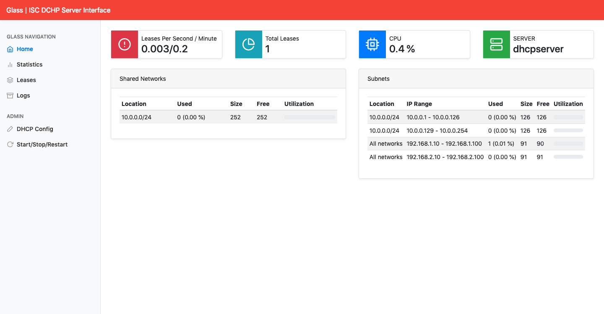
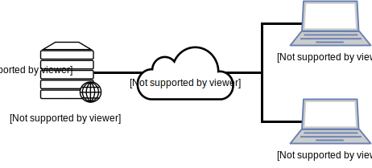
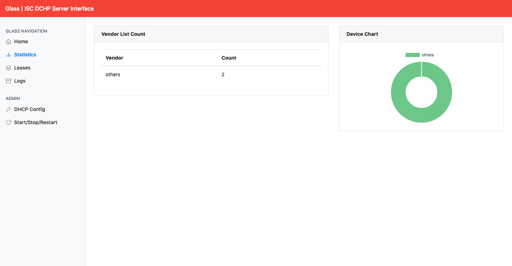
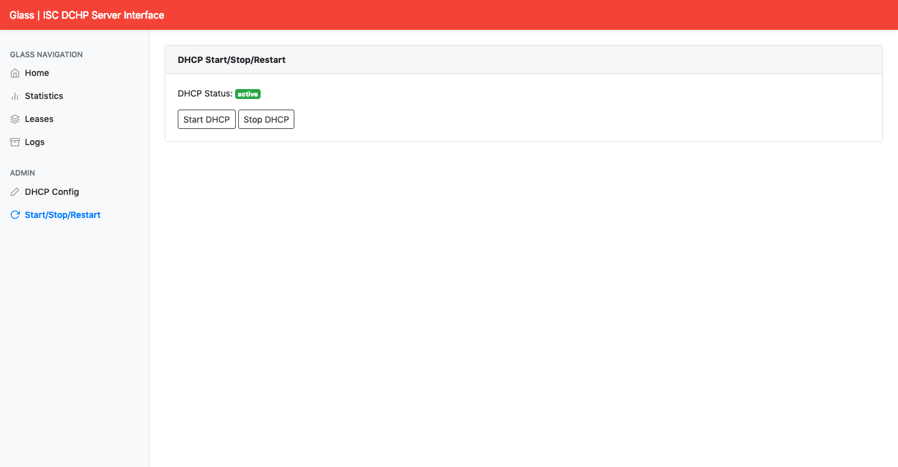

# Monitoramento do ISC DHCP Server

## DESCRIÇÃO
---

O objetivo do presente desafio consiste em criar um monitoramento do serviço DHCP oferecido pelo pacote [isc-dhcp-server](https://www.isc.org/downloads/dhcp/), semelhante ao projeto *open source* [Akkadius/glass-isc-dhcp](https://github.com/Akkadius/glass-isc-dhcp). A Figura 1 ilustra o resultado final do desafio.

*Figura 1 - Layout da aplicação de monitoramento.*<br>


A princípio já foi disponibilizado uma parte da aplicação Web no arquivo [code.zip](code.zip), contudo algumas páginas precisam ser concluídos, e um ambiente virtualizado por meio do arquivo `Vagrantfile`, que é ilustrado na Figura 2.

*Figura 2 - Ambiente virtualizado do code.zip.*<br>


Lembrando que para disponibilizar o ambiente virtualizado basta executar o comando:

```
$ vagrant up
```

Esse comando permitierá acessar o front-end por meio de [http://localhost:8080/public/index.html](http://localhost:8080/public/index.html), enquanto o comando para acessar o servidor descrito no `Vagrantfile` é:

```
$ vagrant ssh dhcpserver
```

Por fim, é importante observar que do total de componentes será exigido a entrega de no mínimo um componente.

## COMPONENTES
---

**COMPONENTE 1 -** Crie o painel de estatística exibido conforme a Figura 3:

*Figura 3 - Painel de Estatistica.*<br>


Primeiro crie o arquivo `api/stats.php`, acessível pela URL [localhost:8080/api/stats.php](localhost:8080/api/stats.php), cuja a resposta deve possuir o padrão deste JSON:

```json
{
  "manufacturers": [
    {
      "type": "others",
      "count": 2
    }
  ]
}
```

O conteúdo do JSON contabiliza os computadores conectados por meio de seu MAC, caso o endereço seja de origem não conhecida ele ficará na contagem da categoria `others`.

Para obter esses valores deve ser usado a saída do comando:

```
$ dhcp-lease-list --parsable
MAC 08:00:27:b7:e1:c1 IP 192.168.1.11 HOSTNAME dhcpclient2 BEGIN 2019-02-20 20:19:30 END 2019-02-20 20:29:30 MANUFACTURER 
MAC 08:00:27:bf:dd:c9 IP 192.168.1.10 HOSTNAME dhcpclient1 BEGIN 2019-02-20 20:21:54 END 2019-02-20 20:31:54 MANUFACTURER 
```

Veja que no final da linha o campo `MANUFACTURER` aparece sem nome conhecido para as duas alocações de IPs, o que significa que eles serão computados na categoria `others`.

Também exiba esses dados de forma tabular no arquivo `/public/templates/dhcp-stats.html`, acessível pela URL [localhost:8080/public/index.php](localhost:8080/public/index.php) no menu `Statistics`, cujo o resultado deve se aproximar ao da Figura 3. Para isto, será necessário escrever seu Javascript no arquivo `/public/js/templates/dhcp-stats.js`.

**COMPONENTE 2 -** Crie o painel de administração exibido conforme a Figura 4:

*Figura 4 - Painel de administração do DHCP.*<br>


Primeiro crie o arquivo `api/service.php` para realizar três ações no serviço DHCP (`start`, `stop` e `status`) conforme as URLs:

* [localhost:8080/api/service.php?command=start](localhost:8080/api/service.php?command=start):

```json
{
  "action": "start"
}
```

* [localhost:8080/api/service.php?command=stop](localhost:8080/api/service.php?command=stop):

```json
{
  "action": "stop"
}
```

* [localhost:8080/api/service.php?command=status](localhost:8080/api/service.php?command=status)

```json
{
  "status": "inactive"
}
```

O conteúdo JSON pode ser obtido pela execução do script `sudo ./scripts/dhcp-service.sh PARAM`, no qual `PARAM` pode ser `start`, `stop` e `status`. Como o script evoca o `systemctl` o resultado gerado é algo desse tipo:

```
$ sudo /var/www/html/api/scripts/dhcp-service.sh status
● isc-dhcp-server.service - ISC DHCP IPv4 server
   Loaded: loaded (/lib/systemd/system/isc-dhcp-server.service; enabled; vendor preset: enabled)
   Active: active (running) since Wed 2019-02-20 21:08:47 UTC; 2h 46min ago
     Docs: man:dhcpd(8)
 Main PID: 5127 (dhcpd)
    Tasks: 1 (limit: 1152)
   CGroup: /system.slice/isc-dhcp-server.service
           └─5127 dhcpd -user dhcpd -group dhcpd -f -4 -pf /run/dhcp-server/dhcpd.pid -cf /etc/dhcp/dhcpd.conf

Feb 20 21:08:48 dhcpserver dhcpd[5127]: Sending on   Socket/fallback/fallback-net
Feb 20 21:08:48 dhcpserver sh[5127]: Sending on   Socket/fallback/fallback-net
Feb 20 21:08:48 dhcpserver dhcpd[5127]: Server starting service.
Feb 20 21:12:27 dhcpserver dhcpd[5127]: DHCPREQUEST for 192.168.1.10 from 08:00:27:bf:dd:c9 (dhcpclient1) via enp0s8
Feb 20 21:12:27 dhcpserver dhcpd[5127]: DHCPACK on 192.168.1.10 to 08:00:27:bf:dd:c9 (dhcpclient1) via enp0s8
```

Veja que `PARAM` com valor o `status` pode obter o valor do JSON na terceira linha, cujo o valor pode ser `Active: active` e `Active: inactive`.

Quanto a interface será criado no arquivo `/public/templates/dhcp-start-stop.html`, acessível pela URL [localhost:8080/public/index.php](localhost:8080/public/index.php) no menu `Start/Stop/Restart `, cujo o resultado deve se aproximar ao da Figura 4. Para isto, será necessário escrever seu Javascript no arquivo `/public/js/templates/dhcp-start-stop.js`.

<!-- <br>
<br>
<br>

> [Alternativa de resposta](code-response.zip) -->
